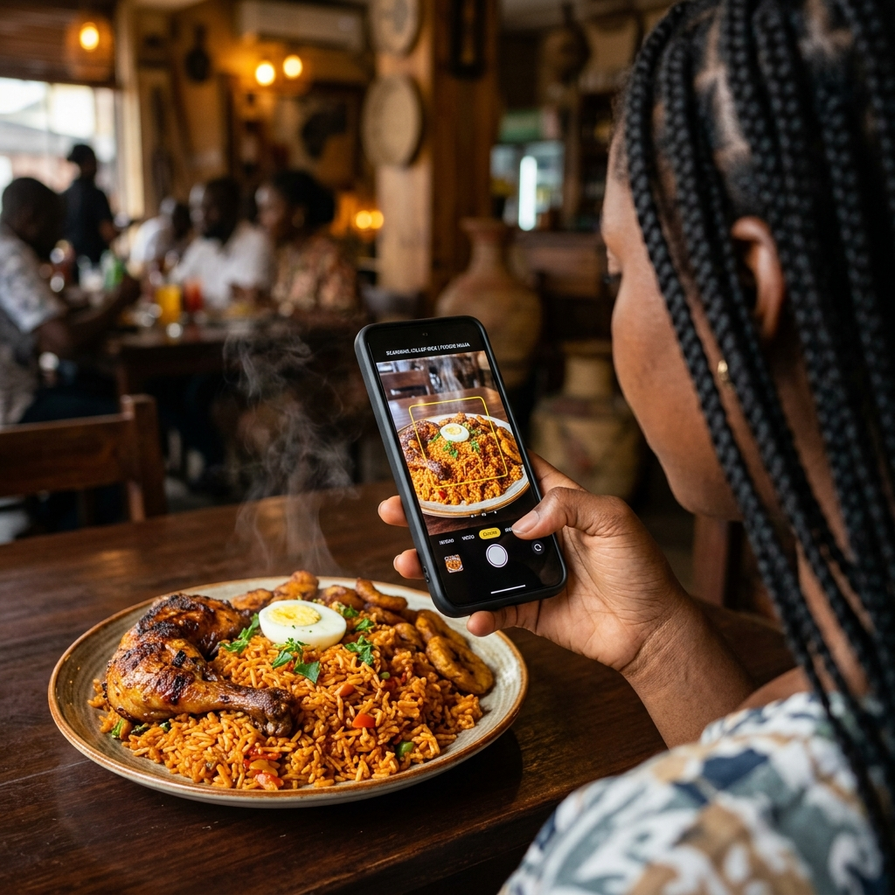
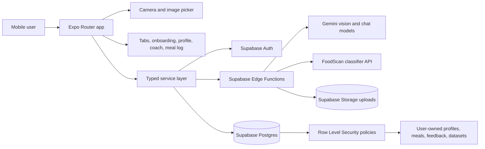
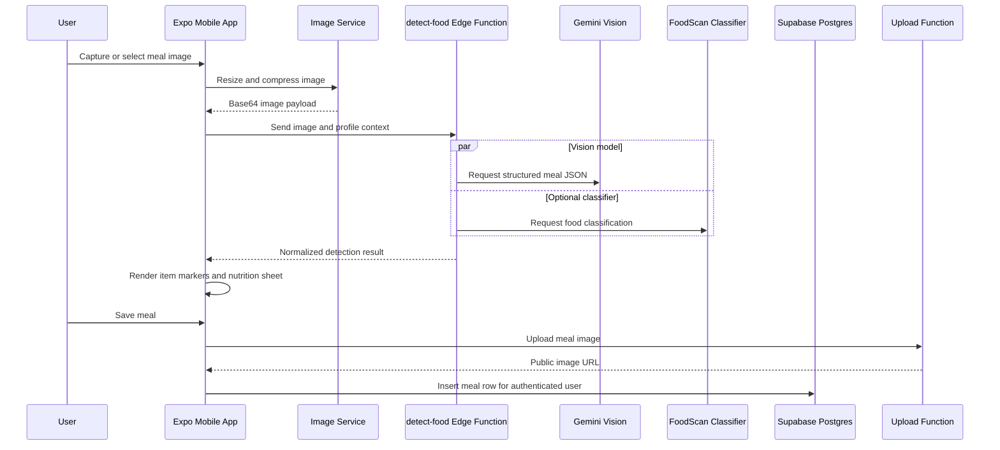
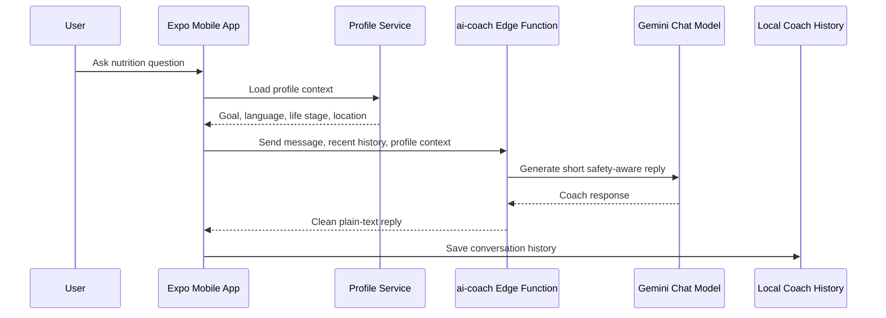
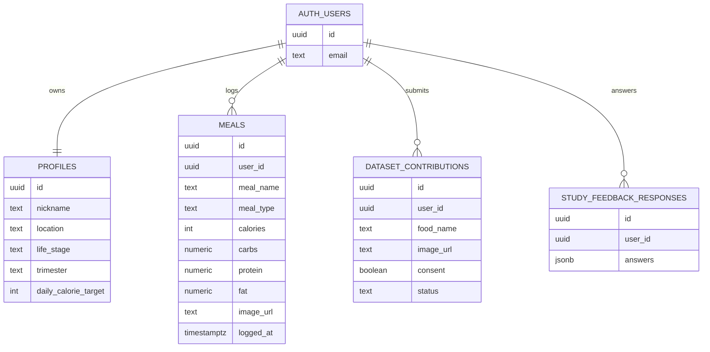

# NutriPadi

<p align="center">
  
</p>

NutriPadi is an AI-powered African food analysis and nutrition coaching mobile app. It helps users scan meals, estimate nutrients, save meal history, receive personalized nutrition guidance, and contribute food images that can improve future model quality for underrepresented African cuisines.

The product is built as a real mobile-first AI application: the phone handles camera capture and user experience, Supabase handles authentication and user-owned data, and server-side Edge Functions protect AI, vision, and upload secrets.



## What The Application Does

- Scans African meals from camera or gallery images.
- Detects meal components such as swallow, soup, rice, beans, plantain, protein, and other local foods.
- Estimates calories, macros, fibre, freshness, portion size, and practical food advice.
- Stores meal logs and visual nutrition history for each authenticated user.
- Personalizes AI coaching with profile context such as life stage, location, goals, language, and health notes.
- Supports maternal nutrition contexts for pregnancy and nursing without assuming those states for general users.
- Collects consented dataset contributions for future food-recognition improvements.
- Loads nutrition lessons, meal suggestions, feedback questions, research metrics, and quick coach prompts from Supabase.

## AI/ML Engineering Highlights

NutriPadi is designed to demonstrate AI product engineering rather than only model prompting.

- **Vision inference boundary:** image analysis runs through the `detect-food` Supabase Edge Function, keeping model keys and provider logic outside the mobile app.
- **Structured model output:** the food vision prompt asks for strict JSON containing image quality, meal name, confidence, detected items, item coordinates, nutrition estimates, freshness, and advice.
- **Hybrid recognition strategy:** the detection function can combine Gemini Vision output with a FoodScan classifier endpoint hosted on Hugging Face Spaces.
- **Typed post-processing:** raw model responses are normalized into `FoodDetectionResult` and `DetectedMealSummary` before the UI renders markers, nutrition sheets, and save actions.
- **Profile-aware personalization:** the coach and vision flows use profile context to tailor advice by goal, location, language, life stage, and calorie target.
- **Human feedback loop:** dataset contributions store consented food labels and images, creating a path toward better African-food evaluation and training data.
- **Safety and privacy boundary:** user data is protected with Supabase Auth and Row Level Security, while AI provider secrets stay server-side.

## Architecture Overview



## Runtime Flow: Meal Scan



## Runtime Flow: AI Coach



## Data Model



## Application Layers

| Layer | Responsibility | Key files |
| --- | --- | --- |
| Mobile shell | Expo app lifecycle, font loading, splash handling, deep-link subscription | `app/_layout.tsx` |
| Routing | File-based auth, onboarding, tab, scan, coach, log, and hidden detail screens | `app/` |
| UI system | Reusable buttons, cards, headers, scan overlays, nutrition sheets, chat UI | `components/` |
| Service layer | Supabase reads/writes, image preparation, AI calls, uploads, profile context | `src/services/` |
| Types | Domain contracts for detection, nutrition, freshness, meals, profiles, chat | `src/types/`, `types/` |
| Backend schema | Tables, public content, user-owned tables, RLS policies | `supabase/schema.sql` |
| Edge Functions | AI coach, food detection, image upload boundary | `supabase/functions/` |

## Key Source Map

```text
app/
  (auth)/              Login, signup, password reset
  (onboarding)/        Language, life stage, goals, health, profile setup
  (tabs)/              Home, scan, AI coach, meal log, profile, hidden detail screens

components/
  scan/                Camera overlays, detection markers, live nutrition sheets
  chat/                Streaming text and typing indicator

src/
  config/              Supabase runtime configuration
  lib/                 Supabase client
  services/            Auth, profile, meal history, AI coach, detection, uploads, content
  types/               Detection, nutrition, freshness contracts

supabase/
  functions/           ai-coach, detect-food, upload-image
  schema.sql           Tables and Row Level Security policies
  seed.sql             Starter content for lessons, suggestions, feedback, prompts
```

## Technology Stack

| Area | Technology |
| --- | --- |
| Mobile framework | React Native, Expo SDK 54 |
| Routing | Expo Router |
| Language | TypeScript |
| Backend-as-a-Service | Supabase Auth, Supabase Postgres, Supabase Storage, Edge Functions |
| AI providers | Gemini Vision, Gemini chat model, optional FoodScan classifier endpoint |
| Camera and media | Expo Camera, Expo Image Picker, Expo Image Manipulator |
| UI and motion | Lucide React Native, Expo Blur, React Native Reanimated, Gesture Handler |
| Storage | Supabase persisted auth session, AsyncStorage-backed local chat history |
| Security | Supabase Row Level Security, server-side Edge Function secrets |

## Backend And Security

Supabase is the source of truth for authenticated application data.

- `profiles`, `meals`, `dataset_contributions`, and `study_feedback_responses` are user-owned tables protected by RLS.
- Public content tables such as `food_categories`, `meal_suggestions`, `nutrition_tips`, `learn_sections`, `research_metrics`, `feedback_questions`, `feedback_options`, and `quick_questions` are readable by the app.
- Edge Functions own provider secrets such as Gemini API keys and upload service credentials.
- The mobile app only receives public Supabase keys and authenticated user sessions.
- Image upload is abstracted behind `upload-image`, so storage can be changed without rewriting scan or dataset screens.

## Local Setup

### Prerequisites

- Node.js 20 or 22 LTS
- npm
- Expo Go, iOS Simulator, or Android Emulator
- A Supabase project

### Install and Run

```bash
npm install
npm start
```

### Mobile Environment

Create a `.env` file in the project root:

```bash
EXPO_PUBLIC_SUPABASE_URL=https://your-project-ref.supabase.co
EXPO_PUBLIC_SUPABASE_KEY=your-supabase-anon-or-publishable-key
```

Then run the SQL setup in Supabase:

```text
supabase/schema.sql
supabase/seed.sql
```

### Edge Function Secrets

Set secrets in Supabase before deploying AI and upload functions:

```bash
GEMINI_API_KEY=your-google-ai-studio-key
GEMINI_MODEL=gemini-3.1-flash-lite
GEMINI_VISION_MODEL=gemini-3.1-flash-lite
FOODSCAN_API_URL=https://your-foodscan-endpoint.example
```

Deploy the functions:

```bash
supabase functions deploy detect-food
supabase functions deploy ai-coach
supabase functions deploy upload-image
```

## Available Scripts

```bash
npm start       # Start Expo
npm run ios     # Start Expo for iOS
npm run android # Start Expo for Android
npm run web     # Start Expo for web
npm run lint    # Run Expo lint
```

## AI/ML Roadmap

- Add an evaluation set for African meal recognition and portion-size estimation.
- Track model confidence, correction events, and failed scans for measurable iteration.
- Promote consented dataset contributions into a review queue for dataset curation.
- Add offline fallback rules for common meals when network inference is unavailable.
- Create model/version metadata on saved meals so nutrition estimates can be audited later.

## License

This project is proprietary and confidential. Unauthorized copying of this project, via any medium, is strictly prohibited.
